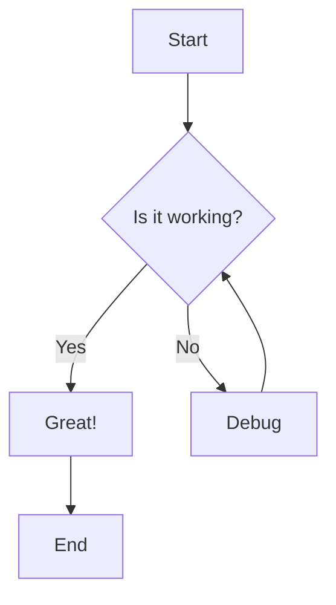

# Welcome to My Technical Blog

Welcome to my personal technical blog! This is where I'll be sharing insights, tutorials, and experiences from my journey in software development.

## What You'll Find Here

This blog covers a wide range of topics including:

- **Web Development**: Modern frameworks, best practices, and performance optimization
- **DevOps**: Deployment strategies, containerization, and infrastructure as code
- **System Design**: Scalable architecture patterns and distributed systems
- **Tools & Technologies**: Reviews, comparisons, and deep dives into popular tools

## About This Site

This site is built with modern web technologies:

- **Next.js 14** with App Router for the framework
- **TypeScript** for type safety
- **Tailwind CSS** for styling
- **Contentlayer** for content management
- **MDX** for rich content authoring

## Code Examples

Here's a simple React component example:

```tsx
import { useState } from 'react'

export function Counter() {
  const [count, setCount] = useState(0)

  return (
    <div className="flex items-center gap-4">
      <button 
        onClick={() => setCount(count - 1)}
        className="px-4 py-2 bg-red-500 text-white rounded"
      >
        -
      </button>
      <span className="text-xl font-bold">{count}</span>
      <button 
        onClick={() => setCount(count + 1)}
        className="px-4 py-2 bg-green-500 text-white rounded"
      >
        +
      </button>
    </div>
  )
}
```

## Mathematical Expressions

You can also include mathematical expressions using KaTeX:

$$
E = mc^2
$$

$$
\int_{-\infty}^{\infty} e^{-x^2} dx = \sqrt{\pi}
$$

## Mermaid Diagrams

Here's a simple flowchart:



## Getting Started

If you're new to web development, I recommend starting with:

1. **HTML & CSS Fundamentals**
2. **JavaScript ES6+ Features**
3. **React Basics**
4. **Node.js and npm**

Stay tuned for more content, and feel free to reach out if you have any questions!
